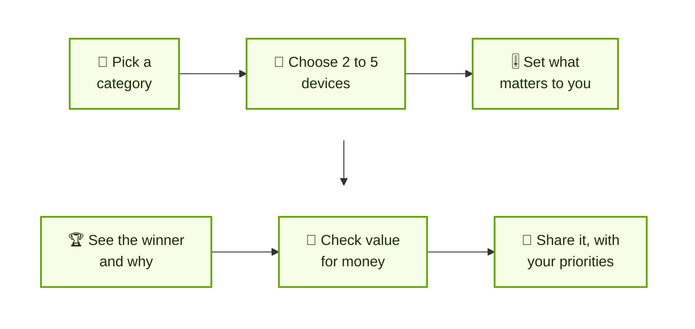
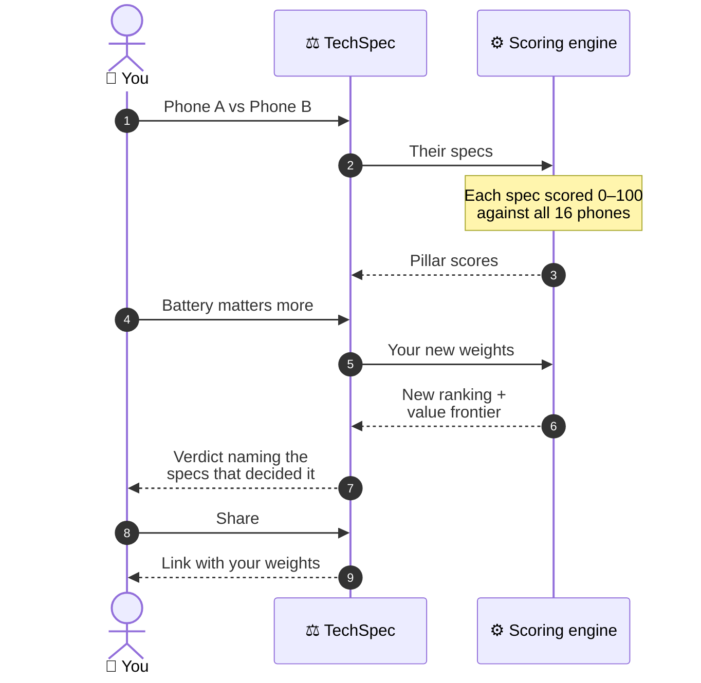
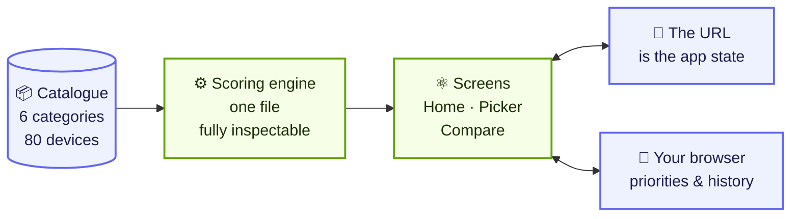
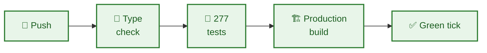

<div align="center">

# ⚖️ TechSpec

### Comparison, weighted your way

**Compare phones, laptops, tablets, smartwatches, headphones and cameras by what matters to *you* —<br/>move a slider, and the scores, the winner and the verdict all recompute instantly.**

<br/>

   
<br/>
  

[](https://github.com/AryanDeshmukh-2711/TechSpec/actions/workflows/ci.yml)   

</div>

---

## 👋 In 30 seconds

<table>
<tr>
<td width="22%">

😟 **The problem**

</td>
<td>

Comparison sites publish one score and expect you to accept their priorities. A gamer and a traveller want very different phones, yet they're shown the same "winner" — and no one can see how that number was made.

</td>
</tr>
<tr>
<td width="22%">

💡 **The idea**

</td>
<td>

TechSpec asks for **your** priorities first. Every spec is scored against the whole category, rolled up into pillars *you* weight with sliders, and any number can be opened to see exactly where it came from.

</td>
</tr>
<tr>
<td width="22%">

🎯 **Who it's for**

</td>
<td>

Anyone choosing a gadget who wants the reasoning, not just a star rating.

</td>
</tr>
<tr>
<td width="22%">

🚦 **Where it is**

</td>
<td>

Works end to end: **6 categories, 80 devices, 215 specs**, with 277 automated tests. It runs entirely in the browser — no account, no server, no tracking.

</td>
</tr>
</table>

---

## 🧭 How it works



---

## ✨ What it can do

<table>
<tr>
<td width="50%" valign="top">

### 🎚️ Your priorities, not theirs
Each category has 6–7 **pillars** — like performance or battery — and you weight each one with a slider. The ranking, the winner and the verdict update the moment you move it.

</td>
<td width="50%" valign="top">

### 🧾 Every number explained
Open any score to see the specs behind it, each one's weight and the points it added. The points always add back up to the score — nothing has to be taken on trust.

</td>
</tr>
<tr>
<td valign="top">

### 💸 Worth the money?
A **value frontier** marks the devices nothing else beats on both price *and* score, so you can see what's genuinely good value rather than just cheap.

</td>
<td valign="top">

### 👥 Six buyer profiles
Every category has six ready-made buyer personas. One tap loads their priorities, and each device shows who it's actually *for*.

</td>
</tr>
<tr>
<td valign="top">

### 🚫 Must-haves
Mark deal-breakers like "needs a telephoto camera", and TechSpec disqualifies devices at decision time — and tells you exactly which requirement ruled each one out.

</td>
<td valign="top">

### 🏠 A home screen that learns
It remembers your priorities, your recent comparisons and devices you viewed but never compared, then suggests matchups with a stated reason. All of it stays on your device.

</td>
</tr>
<tr>
<td colspan="2" valign="top">

### 🔗 Share links that carry your view
One button shares a link that includes your priority weights, so whoever opens it sees the comparison **you** saw, not a neutral default. Plus a **⌘K** command palette to jump to any device from anywhere.

</td>
</tr>
</table>

---

## 📮 How one verdict is made



---

## 🏗️ How it's built



Everything runs in your browser. There's no server to call, which is why it needs no account and sends nothing anywhere.

| Layer | Tool | Why this one |
|---|---|---|
| 🖥️ Interface | **React 19 + TypeScript** | Typed from the data to the screen |
| ⚡ Build | **Vite 6** | Fast development, small production bundle |
| 🎨 Styling | **Tailwind CSS 4** | One consistent design system, light and dark |
| 📊 Charts | **Hand-drawn SVG** | Radar, scatter and bar charts with no chart library at all |
| 🧪 Tests | **Vitest** | Runs the scoring engine and every catalogue on each push |

Only **three** packages ship to the browser: `react`, `react-dom` and `lucide-react` for icons.

---

## 🛡️ Built to be trusted

| | What it means | How it's proven |
|---|---|---|
| 🔍 | **No black-box scores** | Any pillar can be broken down into its specs, weights and points, and the points always sum back to the score. |
| 🧪 | **The maths is pinned down** | The engine is tested against an invented category where every expected number can be worked out by hand, so adding a real phone can never break a test. |
| 📚 | **The data checks itself** | Tests run across all six real catalogues. A typo in a spec name fails the build instead of quietly producing a wrong verdict. |
| 🔒 | **Private by design** | No account, no network requests, no identifier. What it remembers stays in your browser, and one command clears it. |
| ♿ | **Accessible** | Text contrast measured to WCAG AA in both themes, charts never rely on colour alone, and reduced-motion is honoured. |



---

<a name="roadmap"></a>

## 🗺️ Roadmap

| Status | Milestone |
|:---:|---|
| ✅ | Six categories: phones, laptops, tablets, smartwatches, headphones, cameras |
| ✅ | Weighted scoring, explained verdicts, the value frontier, buyer personas and must-haves |
| ✅ | A home screen that learns, the ⌘K palette, and share links that carry your priorities |
| ✅ | Light and dark themes, measured to WCAG AA |
| 🔜 | A bigger catalogue, through the ingest pipeline in `scripts/ingest/` |
| 🔜 | Live retailer prices and price-drop alerts *(needs a backend and a price feed)* |
| 🔜 | Accounts, so saved comparisons follow you between devices |
| 🔜 | More languages |

---

## 📁 What's in this repository

```
📦 TechSpec
├── 📂 src/
│   ├── lib/              the engine: scoring, filters, recommendations, URL state
│   ├── data/categories/  one file per category: its specs, pillars, personas and devices
│   ├── personalisation/  what the home screen remembers, on your device only
│   └── components/       screens, hand-drawn charts, and the ⌘K palette
├── 📂 scripts/ingest/    tools to grow the catalogue from public sources
├── 📂 docs/              the developer guide and research notes
└── 📂 .github/workflows/ the checks that run on every push
```

---

## 👩‍💻 For developers

You need **Node.js 22** (the version CI uses).

```bash
npm install
```

```bash
npm run dev
```

Then open <http://localhost:5173>. To run the same checks as GitHub:

```bash
npm run build
```

**The full developer guide is in [`docs/DEVELOPER-GUIDE.md`](docs/DEVELOPER-GUIDE.md):**

| Topic | Jump to |
|---|---|
| ⚙️ How the numbers are worked out | [How the scoring works](docs/DEVELOPER-GUIDE.md#how-the-scoring-works) |
| ➕ Adding a new kind of device | [Adding a category](docs/DEVELOPER-GUIDE.md#adding-a-category) |
| 🧪 What the tests guard | [Testing](docs/DEVELOPER-GUIDE.md#testing) |
| 🎨 The design rules | [Design](docs/DEVELOPER-GUIDE.md#design) |

---

<div align="center">

**Built by [Aryan Deshmukh](https://github.com/AryanDeshmukh-2711)**

</div>
